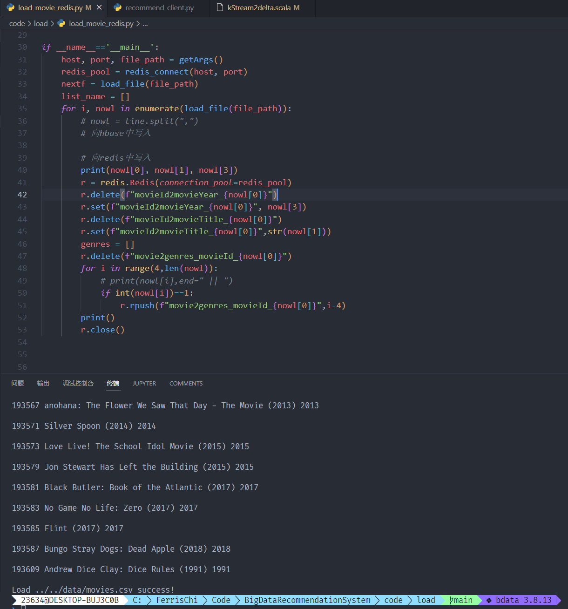
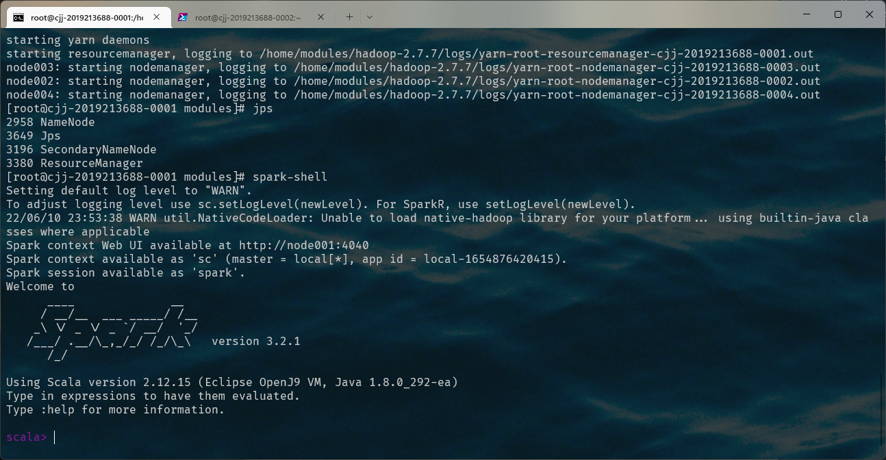
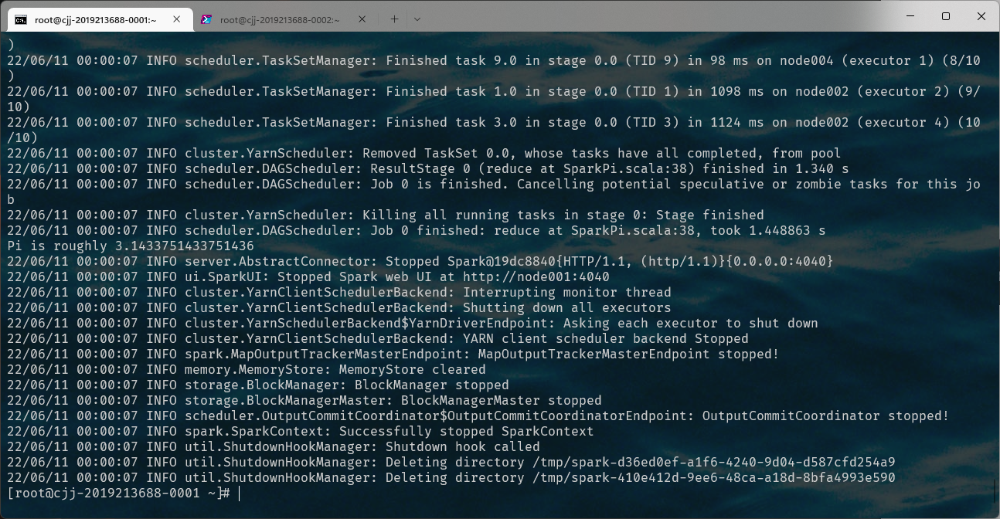
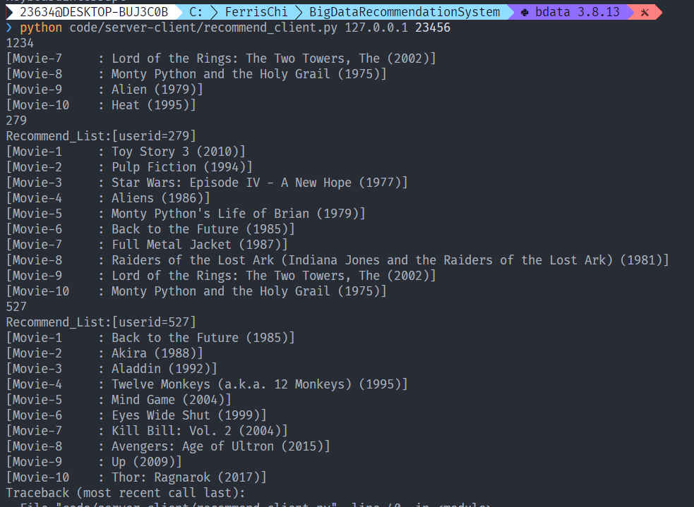
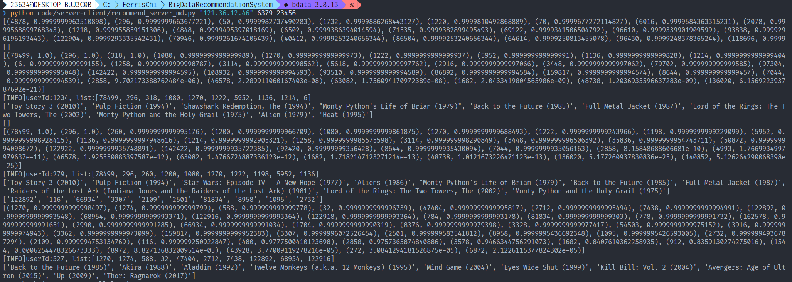
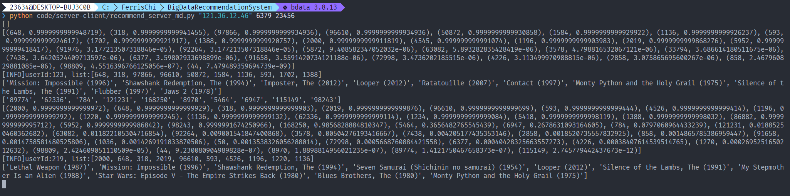
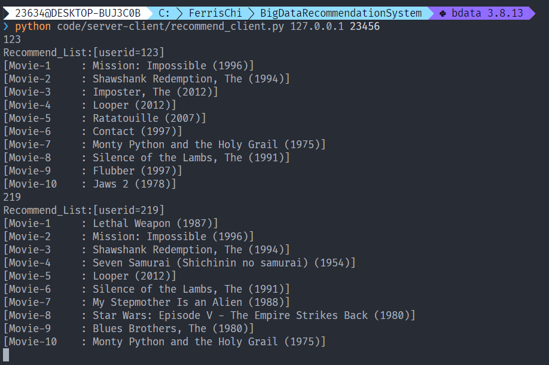

## 基础实验：

* 安装Kafka：

  

* 确认Redis运行成功：

  

* 将movie.csv导入Redis中：

  
  
* 执行结果：

  

## 选做：

* (升级spark版本至3.2.1：可以看到Scala版本为2.12.15)

  

* 验证spark：

  
  
* client截图：

  

* server截图：（输出了CF model的推荐信息）

  

## 提高：

* server截图：

  

* client截图：

  

* 版本：
  * hive-2.1.1
  * hadoop-2..7.7
  * hbase-2.0.2 => hbase-2.4.11
  * kafka-2.11-0.10.22 => 2.12-3.2.0
  * redis-6.0.6
  * spark-2.1.1 => 3.2.1
  * zookeeper => 3.4.6

* 在IJ中将全局库中的scala-sdk更新到2.12.15