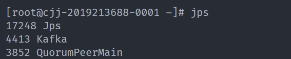
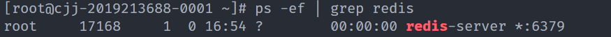
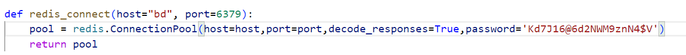
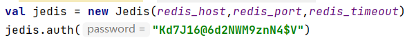
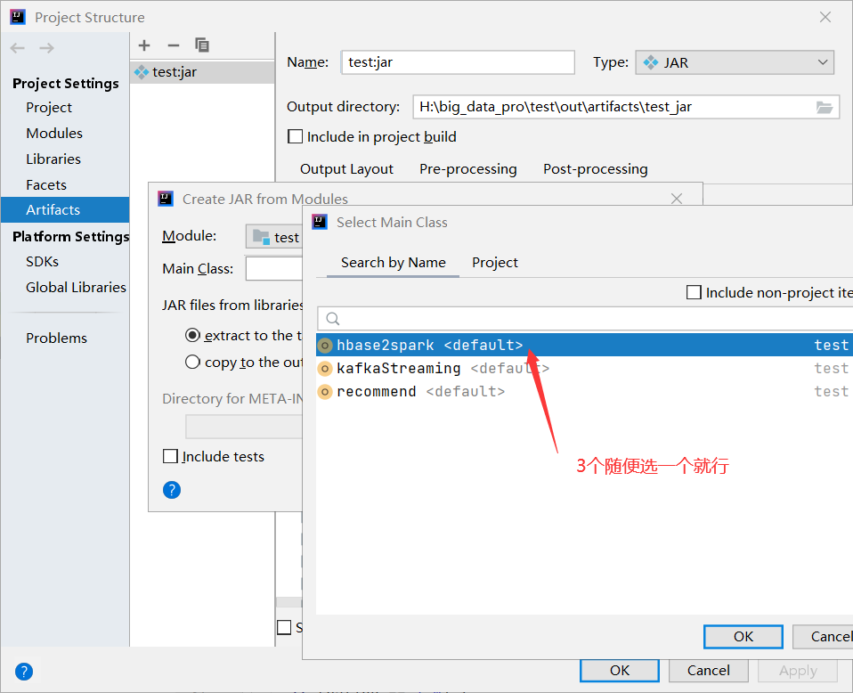
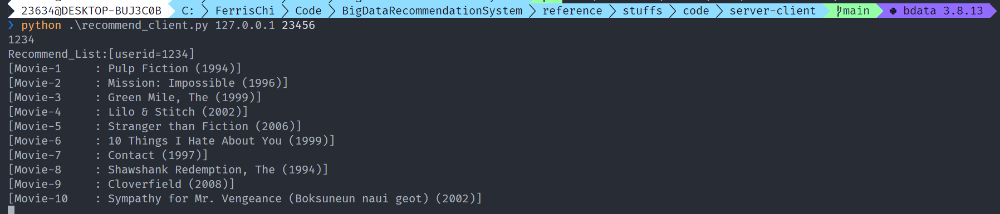

<div class="cover" style="page-break-after:always;font-family:方正公文仿宋;width:100%;height:100%;border:none;margin: 0 auto;text-align:center;">
    </br></br></br>
    <div style="width:70%;margin: 0 auto;height:0;padding-bottom:10%;">
        </br>
        
    </div>
    </br></br></br></br>
    <span style="font-family:华文黑体Bold;text-align:center;font-size:25pt;margin: 10pt auto;line-height:30pt;">实验报告</span>
    </br></br>
    <div style="width:20%;margin: 0 auto;height:0;padding-bottom:30%;">
        
	</div>
    </br>
    <table style="border:none;text-align:center;width:80%;font-family:仿宋;font-size:24px; margin: 0 auto;">
    <tbody style="font-family:方正公文仿宋;font-size:20pt;">
    	<tr style="font-weight:normal;"> 
    		<td style="width:20%;text-align:right;">题　　目</td>
    		<td style="width:2%">：</td> 
    		<td style="width:40%;font-weight:normal;border-bottom: 1px solid;text-align:center;font-family:华文仿宋"> 大数据技术期末推荐系统实验报告</td>     </tr>
    </tbody>              
    </table>
	</br></br></br>
    <table style="border:none;text-align:center;width:72%;font-family:仿宋;font-size:14px; margin: 0 auto;">
    <tbody style="font-family:方正公文仿宋;font-size:12pt;">
    	<tr style="font-weight:normal;"> 
    		<td style="width:20%;text-align:right;">课程名称</td>
    		<td style="width:2%">：</td> 
    		<td style="width:40%;font-weight:normal;border-bottom: 1px solid;text-align:center;font-family:华文仿宋"> 大数据技术基础</td>     </tr>
    	<tr style="font-weight:normal;"> 
    		<td style="width:20%;text-align:right;">上课时间</td>
    		<td style="width:2%">：</td> 
    		<td style="width:40%;font-weight:normal;border-bottom: 1px solid;text-align:center;font-family:华文仿宋"> 2022春</td>     </tr>
    	<tr style="font-weight:normal;"> 
    		<td style="width:20%;text-align:right;">授课教师</td>
    		<td style="width:2%">：</td> 
    		<td style="width:40%;font-weight:normal;border-bottom: 1px solid;text-align:center;font-family:华文仿宋">鄂海红 </td>     </tr>
    	<tr style="font-weight:normal;"> 
    		<td style="width:20%;text-align:right;">姓　　名</td>
    		<td style="width:2%">：</td> 
    		<td style="width:40%;font-weight:normal;border-bottom: 1px solid;text-align:center;font-family:华文仿宋">刘俊杰 池纪君</td>     </tr>
    	<tr style="font-weight:normal;"> 
    		<td style="width:20%;text-align:right;">学　　号</td>
    		<td style="width:2%">：</td> 
    		<td style="width:40%;font-weight:normal;border-bottom: 1px solid;text-align:center;font-family:华文仿宋">2019213687 2019213688</td>     </tr>
    	<tr style="font-weight:normal;"> 
    		<td style="width:20%;text-align:right;">组　　别</td>
    		<td style="width:%">：</td> 
    		<td style="width:40%;font-weight:normal;border-bottom: 1px solid;text-align:center;font-family:华文仿宋"> </td>     </tr>
    	<tr style="font-weight:normal;"> 
    		<td style="width:20%;text-align:right;">日　　期</td>
    		<td style="width:2%">：</td> 
    		<td style="width:40%;font-weight:normal;border-bottom: 1px solid;text-align:center;font-family:华文仿宋">2022年6月16日</td>     </tr>
    </tbody>              
    </table>
	</br></br></br></br></br>
</div>


<!-- 注释语句：导出PDF时会在这里分页 -->

# 大数据技术期末推荐系统实验报告


# 目录

[TOC]

<!-- 注释语句：导出PDF时会在这里分页 -->

## 实验目的

​		掌握Lambda架构

## 实验平台

​		操作系统：CentOS 7.6 64bit

## 实验内容

1. 使用Flume、Kafka实现数据的收集

   本次实验将略去Flume组件。启动一个Kafka服务器，并创建名为“movie_rating_records”的Topic。

2. 使用HBase实现原始数据的存储

   在HBase中创建一个表并命名为“movie_records”，数据格式在附加说明（2）部分。编写一个Kafka消费者，定期从“movie_rating_records”中获取数据并写入HBase。

3. 使用Redis作为缓存数据库实现特征/模型参数的存储

   在本次实验中，将使用Redis作为批式、流式、服务等组件之间的数据交换中间件。例如，将批式计算的得到的特征写入Redis中，等待模型训练时再从Redis读取特征。

4. 使用MapReduce或Spark实现定时启动的批式计算任务

   使用MapReduce/Spark启动定时任务，定时时间为5分钟（5*60*1000ms），计算以下两部分内容：①历史特征的计算②CTR预测模型的训练

5. 使用Spark Streaming或Flink实现流式计算任务

   不同于批式计算，流式计算直接从Kafka中消费“movie_rating_records”Topic，定时时间为30秒（30*1000ms）并完成以下两部分内容的计算：①实时特征的计算②实时TopK的计算

6. 实现服务应答

   服务端根据客户端的请求，从Redis中读取多种召回方式得到的候选列表、批式特征、流式特征、CTR模型参数，根据CTR模型参数与特征，为列表中每个电影打分，并将评分最高的TopK部电影返回给客户端。

7. （选做内容）提升推荐系统的推荐效果①增加更多的召回：使用多种方式进行召回，如spark.mllib中的协同过滤模型，对每个userId产生单独的召回列表。②使用更多特征：进一步从数据中进行挖掘，例如使用上电影的年份等信息。

8. （提高部分）①调研现有的大数据软件架构，并撰写调研报告/综述（需要附上引用）②搭建新的架构（包括但不限于上面提到kappa架构和delta架构）来完成本次实验（推荐系统）

## 实验步骤

### 安装Kafka

1. 解压kafka

   `tar -zxvf kafka_2.11-0.10.2.2.tgz`

2. 将解压得到的文件夹移到/home/modules目录下

   `mv kafka_2.11-0.10.2.2 /home/modules/`

3. 编辑config/server.properties文件，修改delete.topic.enable和zookeeper.connect

   `vim /home/modules/kafka_2.11-0.10.2.2/config/server.properties`

   `delete.topic.enable=ture`

   `zookeeper.connect=cjj-2019213688-0001:2181,cjj-2019213688-0002:2181,cjj-2019213688-0003:2181,cjj-2019213688-0004:2181`

4. 将kafka文件夹通过scp发送到其余结点对应目录下

   `scp -r /home/modules/kafka_2.11-0.10.2.2 root@cjj-2019213688-0002:/home/modules/` 

   `scp -r /home/modules/kafka_2.11-0.10.2.2 root@cjj-2019213688-0003:/home/modules/`

   `scp -r /home/modules/kafka_2.11-0.10.2.2 root@cjj-2019213688-0004:/home/modules/`

5. 编辑config/server.properties文件，修改broker.id分别为1、2、3、4（各节点不一样）

   `vim /home/modules/kafka_2.11-0.10.2.2/config/server.properties`

   `broker.id=4`

6. 各节点启动zookeeper

   `/usr/local/zookeeper/bin/zkServer.sh start`

7. 各节点启动kafka

   `/home/modules/kafka_2.11-0.10.2.2/bin/kafka-server-start.sh /home/modules/kafka_2.11-0.10.2.2/config/server.properties`

8. jps确认kafka启动成功（10分）

   

### 安装Redis（单机部署）

1. 升级gcc

   `yum -y install centos-release-scl`

   `yum -y install devtoolset-9-gcc devtoolset-9-gcc-c++ devtoolset-9-binutils devtoolset-9-libatomic-devel`

   `scl enable devtoolset-9 bash`

2. 解压redis

   `tar -zxvf redis-6.0.6.tar.gz`

3. 进入解压得到的文件夹，编译，安装

   `cd redis-6.0.6`

   `make`

   `make install`

4. 修改redis.conf，设置redis为守护进程，并允许远程连接，关闭保护模式

   `vim /root/redis-6.0.6/redis.conf`

   `daemonize yes`

   `#bind 127.0.0.1`

   `protected-mode no`

   `requirepass Kd7J16@6d2NWM9znN4$V `

5. 启动redis

   `redis-server redis-6.0.6/redis.conf`

6. ps确认redis运行成功（10分）

   

### 安装python3

​		`yum –y install python3`

注：后续使用python3解释器需要在命令行使用python3而非python，安装一些库需要用pip3而不是pip

### 打jar包

​		pom.xml和3个scala代码文件均已提供

​		修改redis相关的python文件，增加参数password 

​		修改 redis相关的scala代码，在每次建立redis连接后，进行认证 

​		打jar包的过程和之前的实验类似，需要注意的是，Main Class随便选一个就可以了



### 运行简易推荐系统

#### 代码说明：

1. load_train_ratings_hbase.py：将json_train_ratings.json作为历史数据直接存储到HBase中
2. load_movie_redis.py：将movies.csv中存储的movieId与movie title的映射关系写入Redis中，用于后续推荐时从movieId转换成movie title
3. generatorRecord.py：将json_test_ratings.json作为实时数据发送到Kafka中
4. recommend_server.py与recommend_client.py：recommend_server等待recommend_client连接，连接后recommend_client可以向recommend_server发送一个userId，recommend_server根据推荐算法从Redis中获取召回列表、特征参数与模型参数后，向recommend_client返回推荐列表。向recommend_client是一个交互式程序，输入用户id，会输出推荐结果。
5. hbase2spark.scala：批式计算程序，计算后将结果写入 Redis
6. kafkaStreaming.scala：流式计算程序，计算后将结果写入 Redis。
7. recommend.scala：推荐模型程序，计算后将结果写入 Redis

####  运行流程：

​	<u>**表示在所有结点都需执行，init表示在初始化系统的时候执行，其余指令只需在主节点上执行。*</u>

​	下面出现的121.36.12.46统一修改为自己主节点的公网ip地址
​    node001统一修改为自己主节点名称
​    spark-sparkstreaming-recommend.jar统一修改为自己的jar包名称

1. 启动HDFS

   `start-all.sh`

2. 启动zookeeper（*）

   `zkServer.sh start`

3. 启动HBase

   `start-hbase.sh`

4. 配置HBase Thrift连接，以便python中的happybase库能够连接Hbase

   `hbase-daemon.sh start thrift`

5. 在HBase中创建对应的表（init）

   `create 'movie_records','details'`

   * 查看HBase数据：`scan 'movie_records',{LIMIT=>5}` 查看movie_records表的前5行

6. 启动load_train_ratings_hbase.py（init）

   `python ./load_train_ratings_hbase.py 121.36.12.46 9090 "movie_records" "../../data/json_train_ratings.json"`

7. 启动redis

   `redis-server /root/redis-6.0.6/redis.conf`

   * 查看redis数据：

     * 进入redis
       `redis-cli -h 127.0.0.1 -p 6379`

     * 查看redis中的key
       `keys [pattern]`
       e.g.: `keys *` （查看所有的keys）

     * 获取key对应的value
       `get [key]`
       e.g.: `get 'movieId2movieTitle_1'`

     * 查看redis中的表(list)
       `lrange [表的名字] 0 -1`

8. 启动load_movie_redis.py（init）

   可在本地执行

   `python .\load_movie_redis.py 121.36.88.159  6379 "../../data/movies.csv"`

9. 启动Kafka（*）

   `kafka-server-start.sh /home/modules/kafka/config/server.properties`

   * 查看Kafka运行状态：Kafka默认端口为**9092**，可以使用命令：netstat -anlpt | grep 9092 或者 lsof -i:9092 来查看9092端口占用情况

10. 创建 Kafka Topic

    `kafka-topics.sh --zookeeper node001:2181 --create --topic movie_rating_records --partitions 1 --replication-factor 1`

11. 启动generatorRecord.py（这个程序会一直运行，不需要等待停止）

    最好在服务器上运行，若要本地Windows/macOS运行，需额外配置kafka外网连接

    `python3 /root/code/load/generatorRecord.py -h node001:9092  -f "/root/data/json_test_ratings.json"`

12. 启动hbase2spark、kafkaStreaming、recommend

    * `spark-submit --class hbase2spark --master yarn --num-executors 3 --driver-memory 512m --executor-memory 512m --executor-cores 1 /root/spark-sparkstreaming-recommend.jar`

    * `spark-submit --class kafkaStreaming --master yarn --num-executors 3 --driver-memory 512m --executor-memory 512m --executor-cores 1 /root/spark-sparkstreaming-recommend.jar`

    * `spark-submit --class recommend --master yarn --num-executors 3 --driver-memory 512m --executor-memory 512m --executor-cores 1 /root/spark-sparkstreaming-recommend.jar`

    * delta:

      ```
      spark-submit --class kStream2delta --master yarn --num-executors 3 --driver-memory 512m --executor-memory 512m --executor-cores 1 /root/spark-sparkstreaming-recommend_d.jar
      
      --packages org.apache.spark:spark-sql-kafka-0-10_2.12:3.2.1
      --packages io.delta:delta-core_2.12:1.2.1
      ```

13. 启动recommend_server.py

    可在本地执行

    `python code/server-client/recommend_server.py "121.36.88.159" 6379 23456`

14. 启动recommend_client.py

    可在本地执行

    `python code/server-client/recommend_client.py 127.0.0.1 23456`

在客户端输入userid，返回结果截图，返回结果可能与图片不一致（40分）



### 选做内容2 提升推荐系统的推荐效果（20分）

#### 增加更多的召回（10分）

​		使用多种方式进行召回，如spark.mllib中的协同过滤模型，对每个userId产生单独的召回列表。


#### 使用更多特征（10分）

​		进一步从数据中进行挖掘，例如使用上电影的年份等信息。


### 提高部分（20分）

#### 调研现有的大数据软件架构，并撰写调研报告/综述（需要附上引用）（5分）

​		另见调研报告。

#### 搭建新的delta架构来完成本次实验（推荐系统）（15分）


