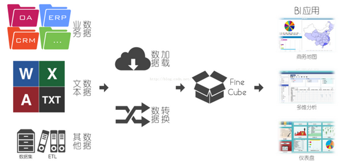
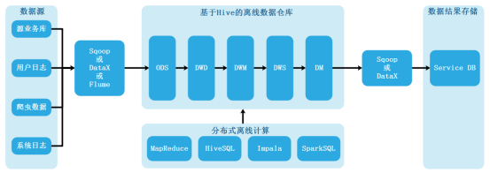
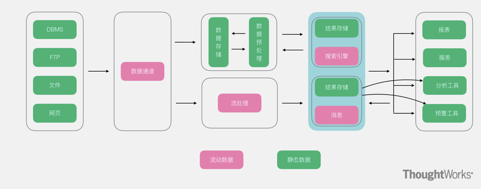
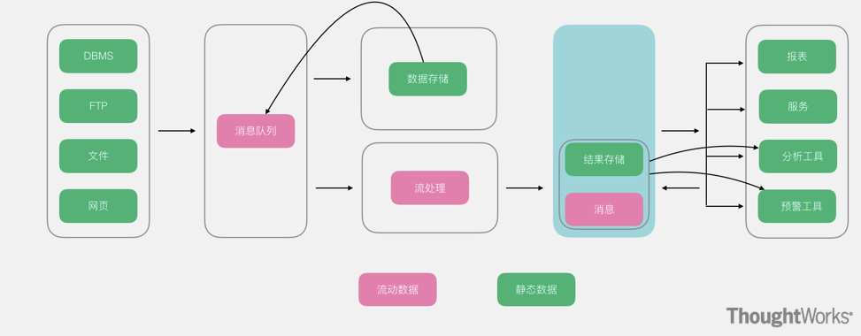
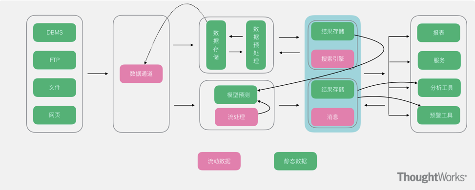
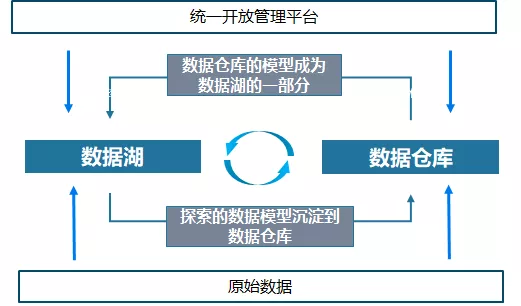
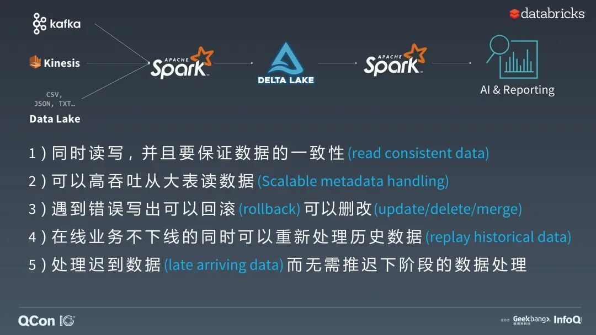

# 大数据软件架构调研

2019213687 刘俊杰	2019211301班

2019213688 池纪君	2019211301班

[TOC]

## 前言

​		随着互联网时代的到来，产生的数据量暴增，也催生了大量的数据分析工作，包括数据挖掘，数据探索等等。在基于Hadoop的分布式系统架构出现前后，可以将大数据分析架构分为经典架构和新兴架构。另外需要说明的是，在本调研报告中提到的大数据软件架构主要指数据仓库架构。数据仓库（数仓， Data Warehouse），是个面向主题的、集成的、时变的、非易失的数据集合，支持管理者的决策过程。这几个关键词也将数据仓库与其他数据存储系统（如关系数据库系统、事务处理系统和文件系统）相区别。在本报告中，我们将首先调研BI系统为主的传统大数据分析架构，再对Lambda、Kappa、Unified数仓进行简要介绍，最后引入数据湖和基于湖仓一体的Delta架构。

## 正文

### Hadoop前的大数据分析架构

​		在Hadoop系列的大数据分析系统大行其道之前，数据分析工作已经经历了长足的发展，尤其是以BI系统为主的数据分析，已经有了稳定的技术方案和生态系统。BI系统（Business Intelligence System）也叫数据分析系统，定位于分析及诊断各业务侧平台的综合健康程度，同时也可以对项目的潜在风险进行预判和预警，是一款将数据从多数据源获取、集成、维护并存储，并基于基础数据，实现灵活调用及可视化展示的数据分析展示系统。对于BI系统来说，大概的架构图如下：

​		BI系统中的核心模块是Cube，基于Cube可以进行多种操作。大部分BI系统都基于关系型数据库SQL，但是SQL在多维操作和分析的表示能力上相对较弱，所以Cube有自己独有的，具有更强的多维表现能力的查询语言MDX。BI的问题包括：1）对于非结构化和半结构化数据的处理非常乏力；2）ETL程序复杂；3）处理的数据量小；4）数据库的约束影响了性能；5）ETL动作对数据进行的预先假设和处理影响了机器学习的学习效果。

​		基于Hadoop发展而来的大数据分析架构解决了传统数仓的性能问题。通过分布式计算、分布式存储和检索和存储的结合，产生了众多的新兴大数据架构。

### 以 Hadoop 为基础的大数据架构

#### 离线数仓

​		离线数仓随着Hadoop 大数据技术的出现而出现，它用大数据中的工具，包括基于Hive的离线数据库和MapReduce等分布式任务管理，来替代经典数仓中的传统工具，但是和经典的大数据处理架构没有根本区别。

​		离线的大数据架构的问题在于，其不能够处理实时性业务。随着越来越多的应用上线，大家发现，其实批处理和流计算配合使用，才能满足大部分应用需求。而对于用户而言，其实他们并不关心底层的计算模型是什么，用户希望无论是批处理还是流计算，都能基于统一的数据模型来返回处理结果，于是Lambda数仓架构被提出。

#### Lambda数仓架构

​		Lambda 架构兼顾了离线批处理和在线实时处理两种方式，解决了离线数仓的问题。它适合于以批处理为主，实时流处理为辅的业务场景。Lambda架构中数据从底层的数据源开始，经过各种各样的格式进入大数据平台，在大数据平台中经过Kafka、Flume等数据组件进行收集，然后分成两条线进行计算。一条线是进入流式计算平台（例如 Storm、Flink或者Spark Streaming），计算实时指标；另一条线进入批量数据处理离线计算平台（例如Mapreduce、Hive，Spark SQL），保证数据有效、准确性。

​		Lambda 架构的弊端在于：1）需要同时实现批处理和流处理两种方式，容易出现两边计算逻辑不一致，且开发成本高；2）数据有两条不同链路，容易造成数据的不一致性；3）数据更新成本高，可能出现批处理难以完成的情况。为解决Lambda架构的问题，产生了Kappa架构。

#### Kappa数仓架构

​		Kappa 架构完全废弃了批处理层，即便是批处理也是通过消息队列回溯以流计算的方式来完成，这样就实现了批流一体，从而避免了冗余工作，并简化了技术栈。其核心思想是通过改进流计算系统来解决数据全量处理的问题，使得实时计算和批处理过程使用同一套代码。

​		此外Kappa架构认为只有在有必要的时候才会对历史数据进行重复计算，而如果需要重复计算时，Kappa架构下可以启动很多个实例进行重复计算,方式是通过上游重放完成(从数据源拉取数据重新计算)。

​		Kappa架构的弊端在于：1）对消息队列的存储性能和稳定性要求高，消息队列的回溯能力不及离线存储；2）消息队列中的数据有存储时效性，且当前无法使用 OLAP 引擎直接分析消息队列中的数据；3）全链路依赖消息队列的实时计算，可能会因为数据的时序性导致结果不正确。

#### Unified数仓架构

​		Unified结构依旧以Lambda架构为主，不过对其进行了改造，在流处理层新增了机器学习层。数据在经过数据通道进入数据仓库后，新增了模型训练部分，并且将其在流式层进行使用。同时流式层不单使用模型，也包含着对模型的持续训练。使用Unified架构有butterfly architecture。

​		Unifield架构的缺点在于：实施复杂度更高，对于机器学习架构来说，从软件包到硬件部署都和数据分析平台有着非常大的差别，因此在实施过程中的难度系数更高。

#### 湖仓一体（Lake House）与Delta架构

* 在Wikipedia上的解释中，数据湖是一类存储数据自然/原始格式的系统或存储，通常是对象块或者文件。数据湖通常是企业中全量数据的单一存储。全量数据包括原始系统所产生的原始数据拷贝，以及为了各类任务而产生的转换数据，包括报表、可视化、高级分析和机器学习等。数据湖中包括结构化数据（通常来自于关系型数据库）、半结构化数据（CSV、日志、XML、JSON 等）、非结构化数据（Email、文档、PDF 等）和二进制数据（图像、音频、视频等）。它的核心思路是把数据库中的数据进行一定格式转换后， 定时地复制至另一个库里做列式存储，从而满足企业查询和数据分析的诉求。

* 湖仓一体指的是，数据湖和数据仓库可以同时选择，将数据仓库构建于数据湖之上。湖仓一体架构下数据湖和数据仓库的关系如下：

  

  1. 湖和仓的数据/元数据无缝打通，互相补充，数据仓库的模型反哺到数据湖，湖的结构化数据沉淀到数据仓库
  2. 湖和仓有统一的开发体验，存储在不同系统的数据，可以通过一个统一的开发/管理平台操作
  3. 数据湖与数据仓库的数据，系统可以根据规则自动决定哪些数据放在数仓，哪些保留在数据湖，进而形成一体化

* Delta架构引入了一个表存储层，它处理流存储和表存储，并通过单个代码库进行访问。Delta Lake是一个基于云对象存储的表存储工具，它实现了Lake House，即数据湖的构想。为大数据的读写带来了ACID的能力，通过快照隔离机制为HDFS提供了读写一致性的保证，同时Delta Lake提供内部版本的跟踪，使得用户可以轻松进行快照、版本回滚。Delta Lake可以解决工业领域数据产生，获取，分析等涵盖企业数据分析场景下，数据生命周期内的所有问题，因而有着广阔的使用前景。

## 总结

​		在上文中，我们总结了经典的数据分析系统、传统大数据结构、Lambda数仓架构、Kappa数仓架构、Unified数仓架构和新颖的Delta Lake基于数据胡的架构。这些不同的数仓架构各有优劣，在数据架构多样的今天，针对具体的业务，应对大数据平台架构进行不同的设计，也产生了很多混合架构，以满足不同的业务需求。通过大数据架构的发展趋势，我们可以看到，尽管分布式，并行性、实时性和流处理越来越受到青睐，对于数据存储的要求，即数据存储的一致性、统一性仍是大数据架构的根本所在。

## 引用

1. Armbrust M, Das T, Sun L, et al. Delta lake: high-performance ACID table storage over cloud object stores[J]. Proceedings of the VLDB Endowment, 2020, 13(12): 3411-3424.
2. [数据仓库架构的发展进程](https://www.modb.pro/db/325012)
3. [企业数据仓库技术架构](https://blog.jaggerwang.net/qi-ye-shu-ju-cang-ku-ji-shu-jia-gou/)
4. [解读主流大数据架构](https://zhuanlan.zhihu.com/p/40996525)
5. [大数据处理6种技术架构模式](http://xhrong.github.io/2019/03/01/%E5%A4%A7%E6%95%B0%E6%8D%AE%E5%A4%84%E7%90%866%E7%A7%8D%E6%8A%80%E6%9C%AF%E6%9E%B6%E6%9E%84%E6%A8%A1%E5%BC%8F/)